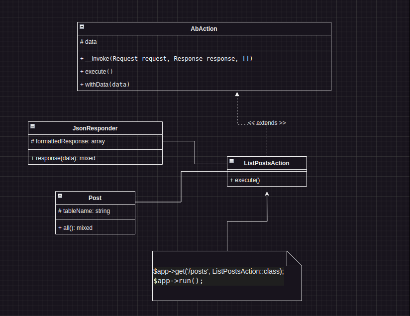

# Gus PHP Setup Project

### My Nginx PHP container
```
https://hub.docker.com/r/gustavovinicius/gusphp
```

```
chmod u+x phpInstall.sh

./phpInstall.sh

composer.sh

composer init
```

### Troubleshooting commands
```
apt-get update
apt-get install php8.1-mbstring -y
apt-get install php8.1-xml -y
composer install
```

### PHP  read-eval-print loop
REPL stands for read-eval-print loop. It's a language shell that reads user input, evaluates the input using a programming language (in this case, PHP), and prints the output to the screen. Then, it returns to the read state (that's the loop part).
```
composer repl
```

### GET posts
```
GET http://localhost/posts
```


