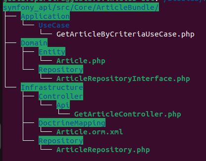

# PHP Setup Project

```
chmod u+x phpInstall.sh

./phpInstall.sh

composer.sh

composer init
```
### Projet Tech Stack
- [Symfony Framework](https://symfony.com/doc/6.3/setup.html)
- [Bundle System](https://symfony.com/doc/6.3/bundles.html)
- [Doctrine](https://symfony.com/doc/6.3/doctrine.html)
- [FOSRestBundle RESTful API](https://fosrestbundle.readthedocs.io/en/3.x/)
- Hexagonal Architecture
- Domain Driven Design
- MySQL
- PostgreSQL
- MongoDB
- Redis
- [RabbitMQ](https://www.rabbitmq.com/)
- GraphQL
- Docker
### Project Setup
- [Setup instructions](./ProjectSetup.md)
- [Config Entity Repository](./ConfigEntityRepository.md)


