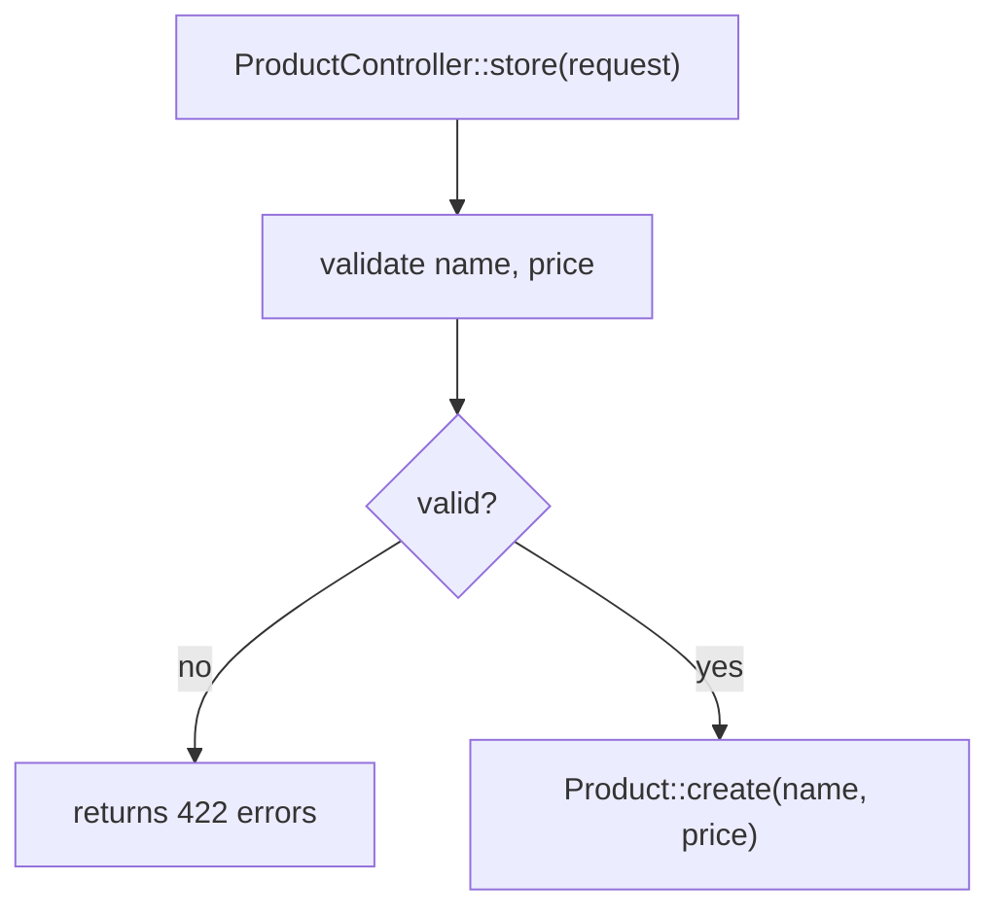

# Analysis

## When to Use
- User asks to analyze, review, or audit code, a class, a module, or a flow
- User asks to search/find a solution or approach for a problem
- Any request where the scope of files to read is not explicit

## Main Directive

Never read files freely during an analysis request. Always confirm scope first.

## Procedure

1. Use targeted search tools (`grep_search`, `file_search`, `semantic_search`) to locate candidate files. Do not open/read file contents yet.
2. Build a short checklist of candidate files, each with a one-line reason why it's relevant.
3. Present the checklist to the user with the `vscode_askQuestions` tool, letting them remove, add, or confirm files.
4. Read only the confirmed files.
5. Proceed with the analysis using only that confirmed file set.
6. After the analysis, ask the user if they want a code flow diagram. Never build it unasked.
7. When confirmed, build the diagram following **Code Flow Diagram**.

### Example `vscode_askQuestions` call

```json
{
  "questions": [
    {
      "header": "Files to Read",
      "question": "Which files should I read for this analysis?",
      "message": "Found these candidates. Select the ones to read, or add others in free text.",
      "multiSelect": true,
      "allowFreeformInput": true,
      "options": [
        { "label": "app/Http/Controllers/UsersController.php", "description": "Main entry point for the request" },
        { "label": "app/Models/User.php", "description": "Model referenced by the controller" },
        { "label": "app/Actions/UpdateUserAction.php", "description": "Business logic invoked by the controller" }
      ]
    }
  ]
}
```

## Output Format

Default answer must be short. Only expand when the user asks for more detail.

### Code Analysis
```
**Summary:** <1-2 lines, what the code does>
**Finding(s):** <up to 3 bullets>
**Files:** <files read>
```

### Solution Search
```
**Best option:** <name/approach>
**Why:** <1 line>
**Alternatives:** <up to 2, 1 line each>
```

## Code Flow Diagram

Build it only after the user confirms. Ask with:

```json
{
  "questions": [
    {
      "header": "Flow Diagram",
      "question": "Do you want a diagram of the code flow?",
      "options": [
        { "label": "Yes", "recommended": true },
        { "label": "No" }
      ]
    }
  ]
}
```

### How to Build It

- Use a Mermaid `flowchart TD` inside a ```mermaid block. Top-down, one node per pipeline stage.
- Node label: `Class::method` plus the action in a few words, separated by `<br/>`.
- Quote every label containing `\`, `::`, `(`, `)` or `/` — e.g. `A["Queues\\Push::onUser(job, data)"]`.
- Label edges with what travels between the stages (`-->|params|`), or leave them unlabeled when the order alone is clear.
- Decision points: rhombus `{...}` with `-- yes -->` / `-- no -->` branches. Include silent dead-ends where the code swallows an error or returns early.
- Follow real control flow, not a file list: who calls whom, what is transformed at each hop, where it exits.
- No invented nodes. Every node must map to code that was read.
- Add `subgraph` only when the diagram exceeds ~10 nodes.
- Placement in the answer: after **Summary**, before **Finding(s)**.

### Reference Example



## References

Every answer must close with a `References` line citing where the conclusion came from (official docs, RFCs, PSR specs, books). Max 2 links.

```
**References:** <name> — <link>
```

End every short answer with: "Ask for more detail if needed."
