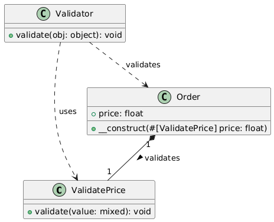

# PHP Validate Attribute Pratical Example

### Class Diagram, PlantUml Format
```js
@startuml

class ValidatePrice {
  + validate(value: mixed): void
}

class Order {
  + price: float
  + __construct(#[ValidatePrice] price: float)
}

class Validator {
  + validate(obj: object): void
}

Order "1" *-- "1" ValidatePrice : validates >
Validator ..> Order : validates
Validator ..> ValidatePrice : uses

@enduml
```
### Image of diagram
<br>
### PHP Code Example
```php
<?php

namespace Gustavo\Api;

use Attribute;

#[Attribute(Attribute::TARGET_PROPERTY | Attribute::TARGET_PARAMETER)]
class ValidatePrice {
    public function validate(mixed $value): void {
        if (!is_numeric($value) || $value < 0) {
            throw new \Exception("Invalid price");
        } else {
            print_r(json_encode([
                'success' => 'Valid'
            ]));
            echo "\n";
        }
    }
}

class Order {
    public function __construct(
        #[\Gustavo\Api\ValidatePrice]
        public float $price
    ) {}
}

class Validator {
    public function validate(object $obj): void {
        $reflector = new \ReflectionClass($obj);
        foreach ($reflector->getProperties() as $property) {
            foreach ($property->getAttributes() as $attribute) {
                $validator = $attribute->newInstance();
                $validator->validate($property->getValue($obj));
            }
        }
    }
}

try {
    // Usage
    $order = new Order(-5);
    (new Validator())->validate($order);
} catch (\Exception $e) {
    print_r(json_encode([
        'error' => $e->getMessage()
    ]));
    echo "\n\n";
}
```
